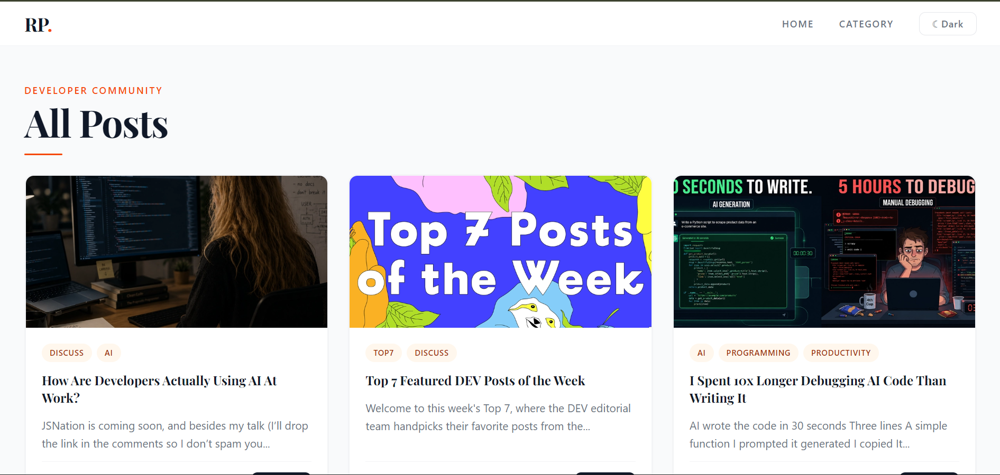
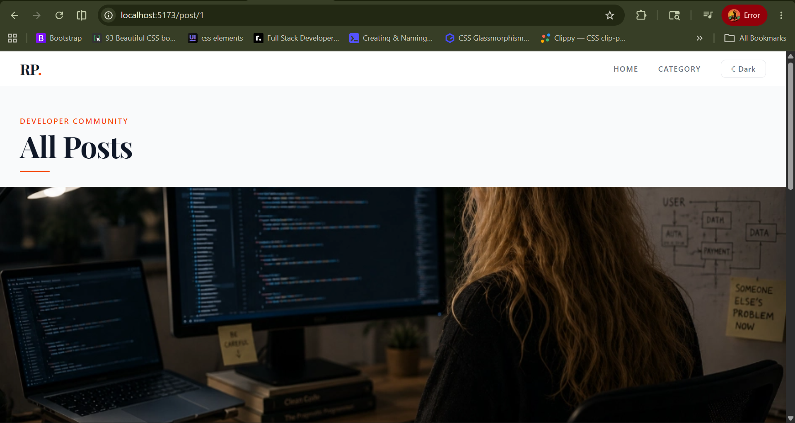
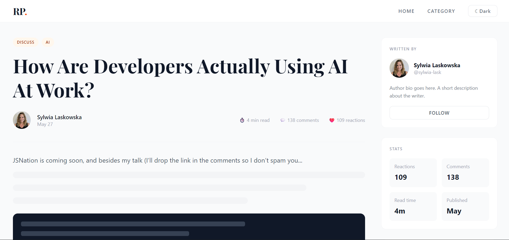

# 📝 Multi-Page Blog App

> A modern multi-page developer blog application built with React, featuring dynamic routing, category-based filtering, reusable components, API integration, and responsive UI design.

---

## 📸 Screenshots





---

## ✨ Features

* 📖 Browse real-time developer articles from the DEV.to API
* 🔀 Dynamic routing with React Router DOM
* 🏷️ Category-based article filtering
* 📂 Dedicated categories page
* 🔎 Dynamic tag navigation using URL params
* ⚡ Custom reusable hook for API fetching
* 🎨 Fully responsive modern UI with Tailwind CSS
* 📄 Individual article detail pages
* 🌈 Dynamic category colors & icons
* 📱 Mobile-friendly layout
* 🚀 Smooth hover animations and transitions

---

## 🛠️ Tech Stack

| Technology          | Purpose              |
| ------------------- | -------------------- |
| React 18            | UI Library           |
| React Router DOM v6 | Routing & Navigation |
| Axios               | API Requests         |
| Tailwind CSS        | Styling              |
| Vite                | Build Tool           |

---

## 🌐 API Used

### DEV.to Articles API

```bash
https://dev.to/api/articles
```

---

## ⚙️ Run Locally

```bash
git clone https://github.com/Abhisheksingh10734/Multi-Page-Blog-App.git

cd Multi-Page-Blog-App

npm install

npm run dev
```

---

## 📁 Project Structure

```bash
src/
├── App.jsx
├── main.jsx
├── UseFetch.jsx
├── index.css
│
├── components/
│   ├── Navbar/
│   │   ├── Navbar.jsx
│   │   ├── Left/
│   │   │   └── Logo.jsx
│   │   └── Right/
│   │       ├── RightNav.jsx
│   │       ├── NavLink.jsx
│   │       └── ThemeBtn.jsx
│   │
│   └── Posts/
│       ├── AllPosts.jsx
│       ├── PostDetails.jsx
│       ├── CategoryPosts.jsx
│       └── PostHead/
│           └── PostHead.jsx
│
└── pages/
    └── Categories.jsx
```

---

## 🧠 What I Learned

* Creating reusable Custom Hooks
* Dynamic & Parameterized Routing
* API Handling using Axios
* Filtering data using tags
* Category-based navigation
* Component Reusability
* Prop Drilling
* Conditional Rendering
* Responsive Design Principles
* Modern UI structuring with Tailwind CSS
* Working with dynamic route params using `useParams()`

---

## 🚀 Future Improvements

* 🌙 Dark Mode
* 🔍 Search Functionality
* 📌 Bookmark Articles
* ❤️ Like System
* 📄 Pagination / Infinite Scroll
* 🔐 Authentication
* 💬 Comments Section

---

## 👨‍💻 Author

**Abhishek Singh**

Frontend Developer passionate about React, UI design, and modern web development.